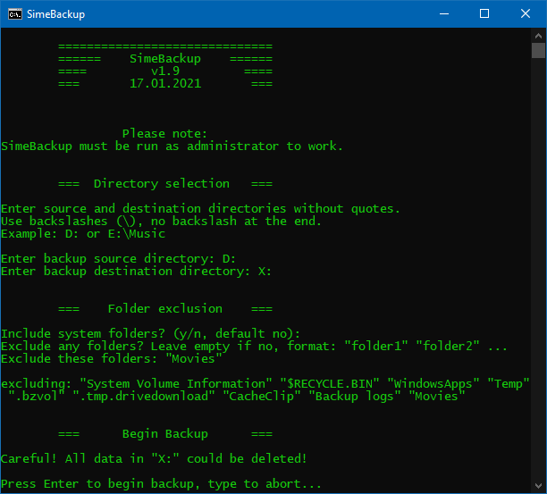

# SimeBackup

SimeBackup is basically a wrapper script for [robocopy] which prompts you for some settings and runs the command for you.

## Use case

You can use SimeBackup to easily create and efficiently maintain a **full (non-incremental) backup** of any folder or drive **on Windows**.

For example, if you use an incremental online backup service, you could use this script for an additional local backup of your complete drive to an old harddrive.

### Folder exclusions

If the backup destination is too small, you can specify folders to exclude from the backup in order to save space.

### Efficient synchronization

On first usage, SimeBackup makes a simple copy of the selected directory or drive.
On subsequent runs, it will only update files that have changed, are new, or were deleted, which of course will usually save a lot of time.

### Use caution!

Pay close attention when typing in the destination folder or drive.
If you enter a wrong destination, the script will start deleting everything there.
You are always warned about this by the script before it starts syncing.

[robocopy]: https://learn.microsoft.com/en-us/windows-server/administration/windows-commands/robocopy
